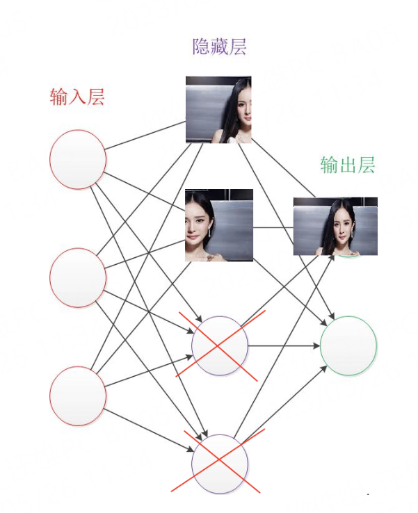

# Deep_Learning_Coding
Numpy实现DNN与CNN网络，

```
|-Deep_Learning_Coding
  |-data 			  存放mnist数据
  |-docs 			  主要包含相关公式推导
  |-images		  说明文档插入图片
  |-nn			    核心代码
  |-Conv.py		  卷积神经网络实现
  |-mlp.py		  全连接网络实现
  |-dataset.py	加载mnist数据集
  |-main.py		  nn模块测试样例
```


~~~
git clone https://github.com/hui126/Deep_Learning_Coding.git
cd Deep_Learning_Coding
python main.py
~~~


## dropout形象理解
参考：https://zhuanlan.zhihu.com/p/77609689

让模型仅学到部分特征也能够识别该结果



## conv的卷积推导
参考：https://blog.csdn.net/oBrightLamp/article/details/84561088

## SGD和Adam之间的区别
参考：https://blog.csdn.net/S20144144/article/details/103417502